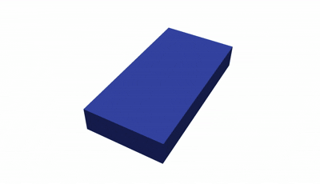
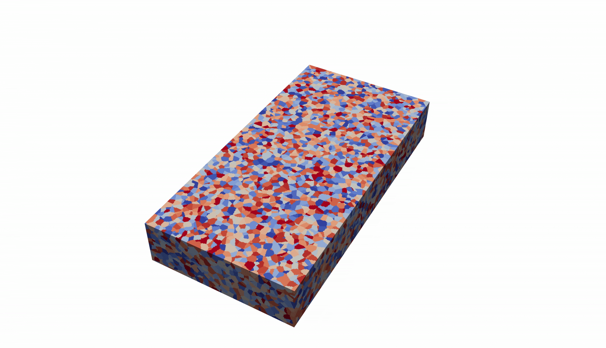
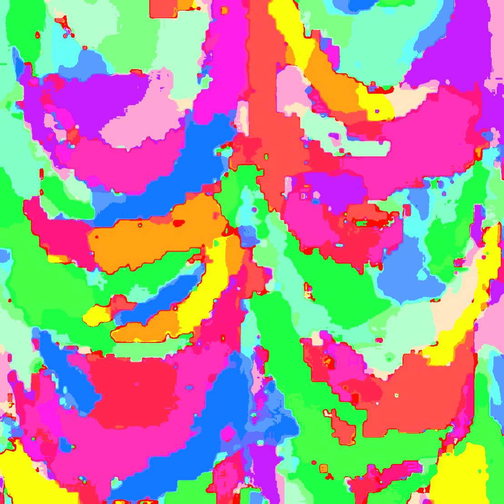
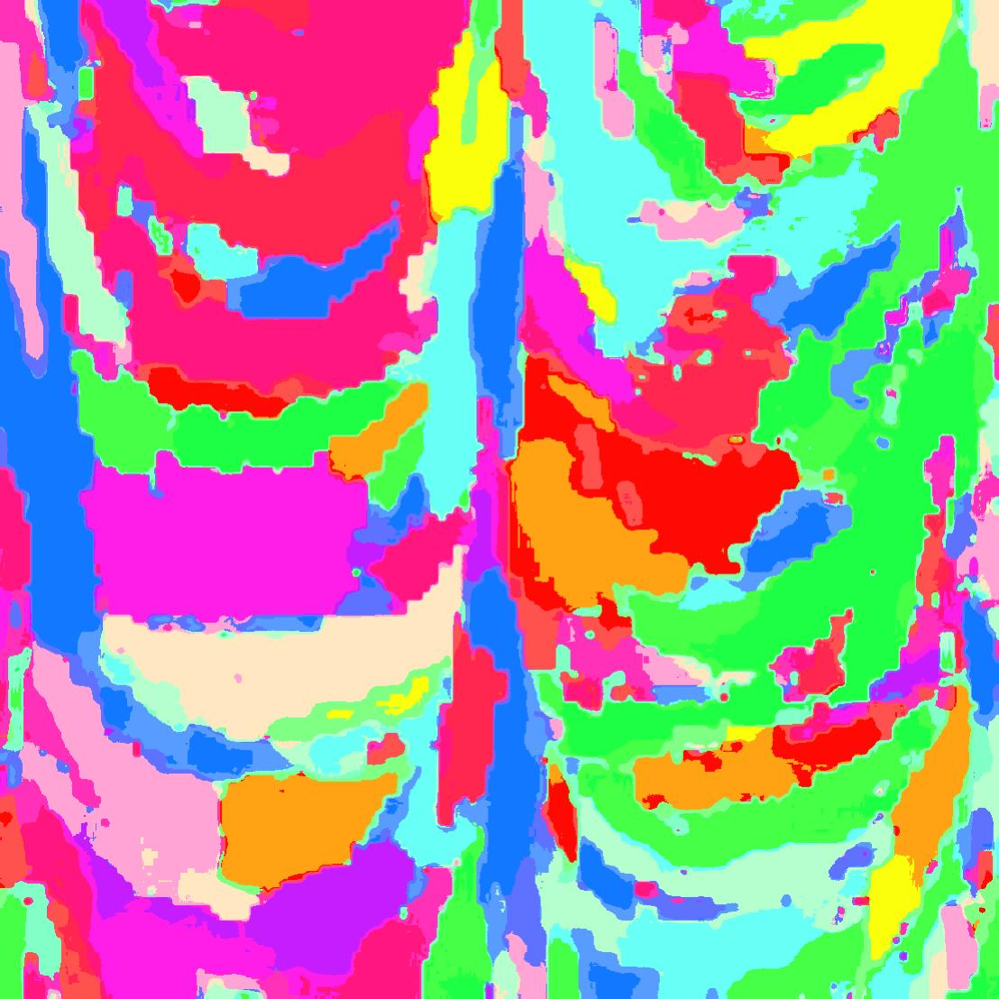

# Sim-to-real diffusion models for microstructure prediction in metal additive manufacturing
This repository contains the codes for implementing sim-to-real microstructure prediction in additive manufacturing (AM).

Two separate folders are achived in this repo: __diffusion__ and __jax-am__, where __diffusion__ contains the codes of __denoising diffusion probalistic moedl (DDPM)__ and the fine-tuning and distillation version, __jax-am__ contains the multi-layer multi-track __computational fluid dunamics (CFD)__ model for temperature field and __phase-field (PF)__ simulation for microsturcture field in AM.

## JAX-AM for multi-layer multi-track CFD and PF simulation in AM
This part is a modified version of the JAX-AM repository of our group (See [JAX-AM](https://github.com/CMSL-HKUST/jax-am)).

__Computational Fluid Dynamics (CFD)__

  

    <em >Multi-track CFD simulation for temperature field.</em>

__Phase-field (PF)__

  

    <em >Multi-layer multi-track PF simulation for microsturcture field.</em>

 ## Denoising diffusion probalistic moedl (DDPM)

A conditional DDPM pre-trained with the simulation microstructures. Then fine-tuned or distilled with experiment microstructures. The code is build upon [Diffusers](https://github.com/huggingface/diffusers).

  

    <em >Microstructure predicted with fine-tuned diffusion model.</em>

  

    <em >Microstructure predicted with distilled diffusion model.</em>

